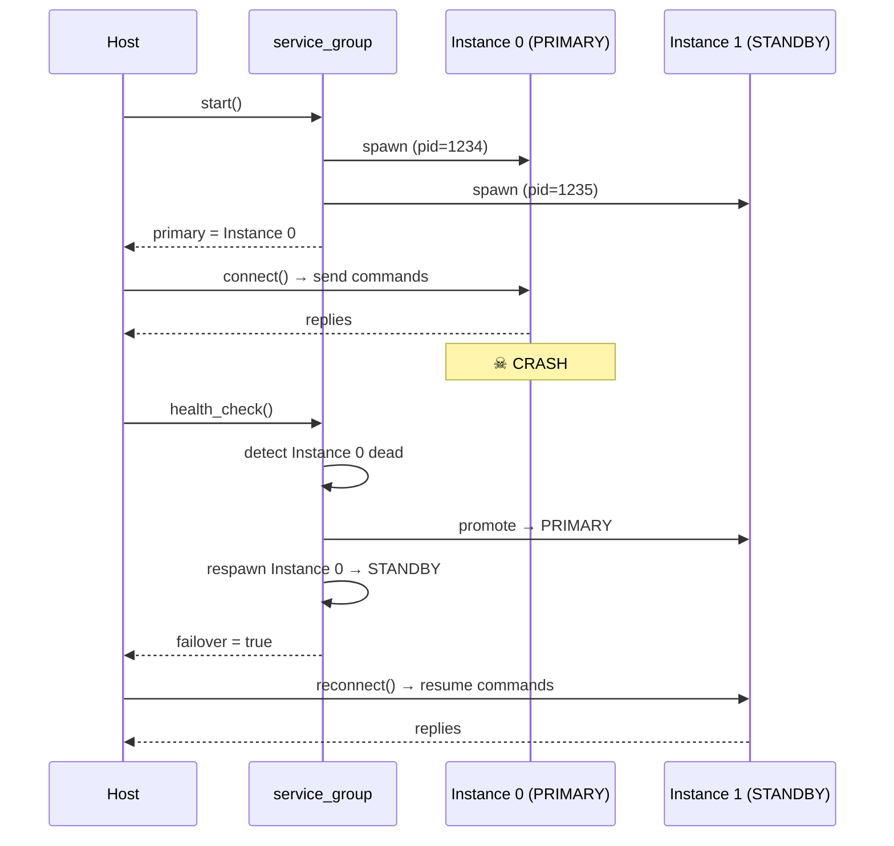

<!-- SPDX-License-Identifier: MIT -->
<!-- SPDX-FileCopyrightText: 2025-2026 natyamatsya contributors -->

# Process Orchestration & Service Discovery

The `libipc/proto/` headers include utilities for managing service lifecycles:
discovering running instances, spawning new ones, monitoring health, and
performing automatic failover when a service crashes.

## Components

### Service Registry (`service_registry.h`)

A shared-memory-backed registry where services announce themselves. Any process
in the same domain sees the same set of registered services.

```cpp
#include "libipc/proto/service_registry.h"

// Both processes use the same domain name
ipc::proto::service_registry registry("my_domain");

// Service side: register on startup
registry.register_service("my_service", "ctrl_channel", "reply_channel");

// Client side: discover by name
auto *entry = registry.find("my_service");
if (entry) {
    // entry->control_channel, entry->reply_channel, entry->pid
}

// List all live services
for (auto &svc : registry.list()) { /* ... */ }

// Clean up entries for dead processes
registry.gc();
```

**Key features:**

- **Shared memory backing** — registry lives in a well-known shm segment
  (`__ipc_registry__<domain>`), visible to all processes
- **Auto-cleanup** — `find()` and `list()` automatically remove entries for
  dead processes (checked via `kill(pid, 0)`)
- **`find_all(prefix)`** — returns all instances matching a prefix, used by
  service groups (e.g. `find_all("audio_compute")` returns
  `audio_compute.0`, `audio_compute.1`, etc.)
- **Capacity** — up to 32 concurrent services per registry

### Process Manager (`process_manager.h`)

POSIX utilities for spawning, monitoring, and shutting down child processes.

```cpp
#include "libipc/proto/process_manager.h"

// Spawn a child process
auto h = ipc::proto::spawn("my_service", "/path/to/binary", {"arg1", "arg2"});

// Check if alive
if (h.is_alive()) { /* ... */ }

// Graceful shutdown: SIGTERM → wait → SIGKILL if needed
auto result = ipc::proto::shutdown(h, std::chrono::milliseconds{3000});
// result.exited, result.exit_code, result.signaled

// Spawn and wait for registry appearance
bool ok = ipc::proto::spawn_and_wait(
    registry, "my_service", "/path/to/binary", {},
    std::chrono::milliseconds{5000});
```

**Functions:**

- **`spawn(name, executable, args)`** — `posix_spawn()` a child, returns
  `process_handle`
- **`request_shutdown(h)`** — send `SIGTERM`
- **`force_kill(h)`** — send `SIGKILL`
- **`wait_for_exit(h, timeout)`** — `waitpid()` with timeout, returns exit
  status
- **`shutdown(h, grace)`** — graceful shutdown sequence: SIGTERM → wait →
  SIGKILL
- **`spawn_and_wait(registry, ...)`** — spawn + poll registry until the
  service registers

### Service Group (`service_group.h`)

Manages a pool of redundant service instances with automatic failover.



```cpp
#include "libipc/proto/service_group.h"

ipc::proto::service_registry registry("audio");

ipc::proto::service_group group(registry, {
    .service_name = "audio_compute",
    .executable   = "./build/bin/audio_service",
    .replicas     = 2,
    .auto_respawn = true,
});

// Spawn all instances, elect primary
group.start();

// Get the current primary
auto *primary = group.primary();
// Connect using primary->entry.control_channel, etc.

// Periodic health check — returns true if failover happened
if (group.health_check()) {
    // Reconnect to the new primary
    primary = group.primary();
}

// Graceful shutdown of all instances
group.stop();
```

**API:**

- **`start()`** — spawn N instances, first alive becomes primary
- **`health_check()`** → `bool` — detect crashes, promote standby, respawn
  dead instances. Returns `true` if a failover occurred (caller should
  reconnect)
- **`primary()`** → `managed_instance*` — current primary with its registry
  entry (channel names, PID)
- **`force_failover()`** — kill the primary and promote standby (useful for
  testing)
- **`alive_count()`** — number of live instances
- **`stop(grace)`** — SIGTERM all instances, wait, SIGKILL stragglers

## How Failover Works

1. **`health_check()`** iterates all instances, calling `kill(pid, 0)` to
   check liveness
1. If the **primary is dead**, the first live standby is promoted
1. If **`auto_respawn`** is enabled, dead instances are respawned as standbys
1. The caller detects the failover (return value `true`) and **reconnects**
   to the new primary's channels
1. The respawned instance registers in the service registry and becomes
   available as a future failover target

## Important Notes

- **Stale shared memory** — services should call
  `ipc::channel::clear_storage()` on their channel names at startup to reset
  connection counts from previous runs
- **Zombie reaping** — when killing a child process, always `waitpid()` before
  checking `is_alive()`, since `kill(pid, 0)` returns true for zombies
- **Registry GC** — call `registry.gc()` at startup to clean entries from
  previous runs that were not cleanly shut down
