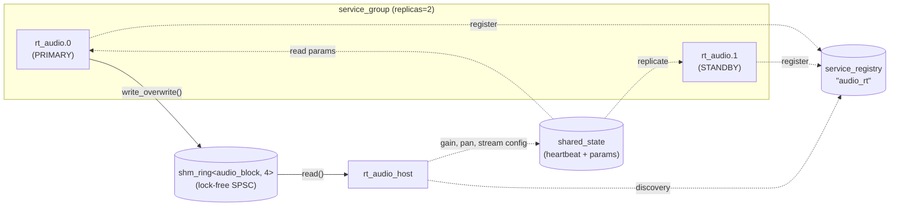

<!-- SPDX-License-Identifier: MIT -->
<!-- SPDX-FileCopyrightText: 2025-2026 natyamatsya contributors -->

# Real-Time Audio Demo

An advanced audio IPC demo designed to avoid dropouts. Builds on the
[basic audio demo](../audio_service/) by replacing FlatBuffers on the data
path with a pre-allocated lock-free ring buffer, adding real-time thread
priority, a shared-memory heartbeat watchdog, and warm standby state
replication for seamless failover.

## Architecture



## Key Differences from the Basic Demo

Feature | Basic (`audio_service`) | Real-time (`audio_realtime`)
--------|------------------------|-----------------------------
Data transport | `ipc::channel` + FlatBuffers | `shm_ring<audio_block, 4>` (zero-alloc)
Parameter updates | FlatBuffers control messages | Atomic writes in `shared_state`
Thread priority | Default | `THREAD_TIME_CONSTRAINT_POLICY`
Heartbeat | PID liveness (`kill(pid,0)`) | Monotonic timestamp in shm (sub-ms)
Standby state | Cold (no config) | Warm (config + params replicated)
Failover gap | Reconnect + re-send config | Activate stream flag only

## New Library Headers

- **`libipc/proto/shm_ring.h`** — generic lock-free SPSC ring buffer over
  shared memory. Power-of-2 capacity, `write_overwrite()` drops oldest on
  full, `read()` returns false on empty. No allocations after init.

- **`libipc/proto/rt_prio.h`** — sets macOS `THREAD_TIME_CONSTRAINT_POLICY`
  for the calling thread. Includes `audio_period_ns()` helper to compute the
  period from sample rate and buffer size.

## Building

```bash
cmake -B build -DLIBIPC_BUILD_PROTO=ON -DCMAKE_BUILD_TYPE=Release
cmake --build build
```

Produces:

- `build/bin/rt_audio_host`
- `build/bin/rt_audio_service`

## Running

```bash
./build/bin/rt_audio_host ./build/bin/rt_audio_service
```

The host will:

1. Spawn 2 redundant service instances (primary + standby)
1. Connect to the primary's ring buffer and shared state
1. Configure the stream (48 kHz, 2 ch, 256 frames) via shared state
1. Replicate config to the standby instance (warm standby)
1. Consume audio blocks for 500 ms, printing periodic stats
1. Set gain to 0.5 via atomic write, replicate to standbys
1. Consume 100 more blocks verifying the gain change
1. Check heartbeat age (should be < 10 ms)
1. **Simulate a crash** — kill primary, promote standby
1. Activate stream on new primary (already has config + params)
1. Consume audio from new primary for 300 ms
1. Shut down all instances

## Expected Output

```text
host: starting service group (2 replicas)...
host: 2 instances alive
host: connected to rt_audio.0 (pid=52536)

host: configuring stream: 48kHz, 2ch, 256 frames
host: replicated config to standby rt_audio.1

host: consuming audio for 500ms...
  block seq=49  frames=256  peak=0.000
host: consumed 136 blocks
  produced=136  consumed=136  underruns=3769  overruns=0  heartbeat_age=0 ms

host: setting gain=0.5 via shared state
host: consuming 100 more blocks with new gain...
  block seq=91  peak=0.072 (should be ~0.5x)

host: heartbeat age = 0 ms (should be <10)

*** SIMULATING PRIMARY CRASH ***

host: new primary = rt_audio.1 (pid=52537)
host: activated stream on new primary
host: consuming audio from new primary for 300ms...
host: consumed 116 blocks from new primary
  produced=133  consumed=116  underruns=2263  overruns=0  heartbeat_age=4 ms

host: --- final state ---
  [0] rt_audio.0            role=STANDBY   pid=53285  alive=1
  [1] rt_audio.1            role=PRIMARY   pid=53282  alive=1

host: shutting down...
host: done
```

## Files

- **`rt_audio_common.h`** — `audio_block` struct, `shared_state` with
  heartbeat and atomic parameters, `shared_state_handle` helper
- **`service.cpp`** — audio render loop with RT priority, ring buffer
  producer, heartbeat updates
- **`host.cpp`** — ring buffer consumer, heartbeat watchdog, state
  replication, failover demo
- **`CMakeLists.txt`** — builds both executables

## Design Notes

- **No FlatBuffers on the data path** — `audio_block` is a trivially copyable
  POD struct. `shm_ring` uses `memcpy`, no serialization overhead.
- **Overwrite mode** — the producer never blocks. If the consumer falls behind,
  the oldest block is silently dropped (`overruns` counter increments).
- **Underrun tracking** — when the consumer finds an empty ring, it counts an
  underrun. In a real DAW this would output silence.
- **Heartbeat resolution** — `steady_clock` nanosecond timestamps in shared
  memory, checked by the host. Detects stalls within 2 buffer periods.
- **Warm standby** — the host replicates stream config and parameters to all
  standby instances. On failover, only the `stream_active` flag needs to be
  set — no re-configuration needed.
