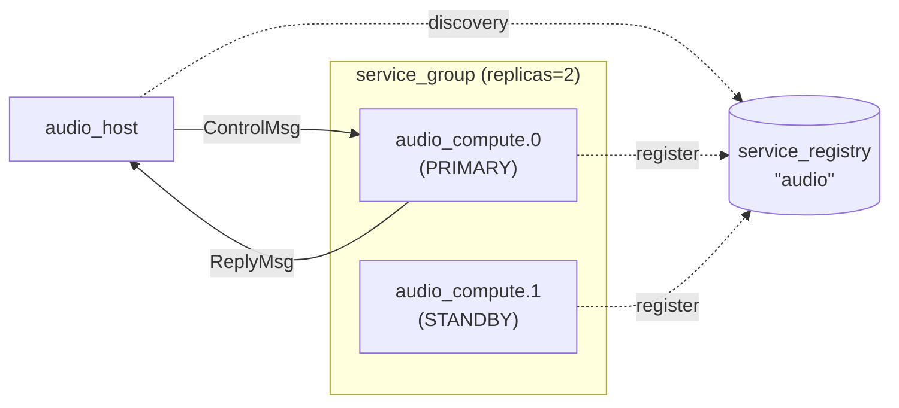

# Audio Service Demo

A complete example of a redundant audio compute service using the cpp-ipc
protocol layer. Demonstrates FlatBuffers-based typed messaging, service
discovery, process orchestration, and automatic failover on crash.

## Architecture



## Protocol

Defined in `audio_protocol.fbs`:

- **Control messages** (host → service): `StartStream`, `StopStream`,
  `SetParam`, `GetParam` — wrapped in a `ControlMsg` table with a `seq`
  number and a `ControlPayload` union
- **Reply messages** (service → host): `Ack`, `ParamValue` — wrapped in a
  `ReplyMsg` table with a `ReplyPayload` union
- **Audio data struct**: `AudioBufferHeader` — a FlatBuffers `struct` (fixed
  size, trivially copyable) for zero-overhead audio buffer transport

## Building

```bash
cmake -B build -DLIBIPC_BUILD_PROTO=ON -DCMAKE_BUILD_TYPE=Release
cmake --build build
```

This builds `flatc`, generates `audio_protocol_generated.h`, and compiles:

- `build/bin/audio_host` — the host/client
- `build/bin/audio_service` — the compute service

## Running

### Automatic orchestration (recommended)

The host spawns, discovers, and manages the service:

```bash
./build/bin/audio_host ./build/bin/audio_service
```

This will:

1. Spawn 2 redundant service instances (primary + standby)
1. Connect to the primary via discovered channel names
1. Send control commands: StartStream → SetParam → GetParam
1. **Simulate a crash** by killing the primary
1. Detect the crash, promote the standby, respawn a replacement
1. Reconnect to the new primary and resume commands
1. Shut down all instances cleanly

### Manual (separate terminals)

Start the service (with optional instance ID):

```bash
./build/bin/audio_service       # default instance
./build/bin/audio_service 0     # instance 0
./build/bin/audio_service 1     # instance 1
```

The service registers itself in the shared-memory registry and waits for
commands.

## Expected Output

```text
host: starting service group (2 replicas)...
audio_service[audio_compute.0]: starting (pid=49204)...
audio_service[audio_compute.0]: registered in service registry
audio_service[audio_compute.1]: starting (pid=49205)...
audio_service[audio_compute.1]: registered in service registry
host: 2 instances alive
host: connecting to audio_compute.0 (pid=49204) ctrl='audio_ctrl_0' reply='audio_reply_0'
host: connected (recv_count=1)
host: sending StartStream (48kHz, 2ch, 256)
host:   ack ref_seq=1 status=0
host: sending SetParam(Gain, 0.75)
host:   ack ref_seq=2 status=0

host: --- instances before crash ---
  [0] audio_compute.0           role=PRIMARY   pid=49204  alive=1
  [1] audio_compute.1           role=STANDBY   pid=49205  alive=1

*** SIMULATING PRIMARY CRASH ***

host: --- instances after failover ---
  [0] audio_compute.0           role=STANDBY   pid=49206  alive=1
  [1] audio_compute.1           role=PRIMARY   pid=49205  alive=1
host: connecting to audio_compute.1 (pid=49205) ctrl='audio_ctrl_1' reply='audio_reply_1'
host: connected (recv_count=1)
host: sending StartStream (re-sent after failover)
host:   ack ref_seq=3 status=0
host: sending GetParam(Gain) on new primary
host:   param 0 = 1.000000

host: shutting down all instances...
host: done
```

## Files

- **`audio_protocol.fbs`** — FlatBuffers schema definition
- **`service.cpp`** — audio compute service (accepts instance ID, self-registers)
- **`host.cpp`** — host with service group orchestration and failover demo
- **`CMakeLists.txt`** — builds both executables, runs `flatc` code generation

## Key Concepts Demonstrated

- **Typed channels** — `ipc::proto::typed_channel<audio::ControlMsg>` for
  compile-time type safety on IPC messages
- **FlatBuffers unions** — `ControlPayload` and `ReplyPayload` for
  polymorphic messages over a single channel
- **Service registry** — shared-memory discovery of running service instances
- **Service group** — redundant instance management with primary/standby roles
- **Failover** — automatic crash detection, promotion, respawn, and reconnect
- **Stale state cleanup** — `clear_storage()` on service startup,
  `registry.gc()` on host startup
