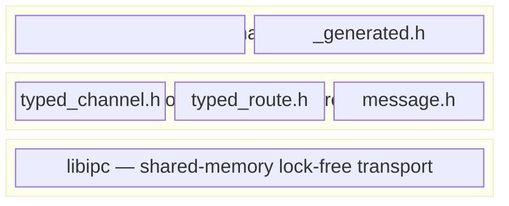

<!-- SPDX-License-Identifier: MIT -->
<!-- SPDX-FileCopyrightText: 2025-2026 natyamatsya contributors -->

# Typed Protocol Layer

The `libipc/proto/` headers provide a generic, header-only layer that combines
cpp-ipc's shared-memory transport with [FlatBuffers](https://flatbuffers.dev/)
for type-safe, zero-copy message passing between processes.

## Overview



## Headers

### `libipc/proto/message.h`

- **`ipc::proto::message<T>`** — wraps a received `ipc::buff_t`. Call `root()`
  for zero-copy access to the FlatBuffer root table. Supports `verify()` for
  untrusted data, `operator bool` for empty checks, and `operator->` for
  direct field access.

- **`ipc::proto::builder`** — wraps `flatbuffers::FlatBufferBuilder`. Use
  `fbb()` to build messages, then `finish(offset)` to finalize. Pass the
  builder directly to `send()`.

### `libipc/proto/typed_channel.h`

`ipc::proto::typed_channel<T>` — a typed wrapper around `ipc::channel`.

```cpp
#include "my_protocol_generated.h"
#include "libipc/proto/typed_channel.h"

// Sender
ipc::proto::typed_channel<MyMsg> ch("my_channel", ipc::sender);
ipc::proto::builder b;
auto off = CreateMyMsg(b.fbb(), /* fields */);
b.finish(off);
ch.send(b);

// Receiver
ipc::proto::typed_channel<MyMsg> ch("my_channel", ipc::receiver);
auto msg = ch.recv();       // blocking
auto msg = ch.try_recv();   // non-blocking
auto msg = ch.recv(1000);   // 1s timeout

if (msg) {
    auto *root = msg.root();   // zero-copy FlatBuffer access
    root->my_field();
}
```

### `libipc/proto/typed_route.h`

`ipc::proto::typed_route<T>` — same API as `typed_channel`, but wraps
`ipc::route` (single-writer, broadcast to N readers).

## Defining a Protocol

1. Write a `.fbs` schema:

```fbs
namespace myapp;

table Ping { seq:uint64; payload:string; }
table Pong { seq:uint64; status:int32; }
```

1. Generate the C++ header:

```bash
flatc --cpp -o build/ my_protocol.fbs
```

1. Include and use:

```cpp
#include "my_protocol_generated.h"
#include "libipc/proto/typed_channel.h"
```

## CMake Integration

Enable with `-DLIBIPC_BUILD_PROTO=ON`. This fetches FlatBuffers v25.2.10 via
`FetchContent` and builds `flatc`. To compile schemas in your own CMake:

```cmake
add_custom_command(
    OUTPUT  ${CMAKE_CURRENT_BINARY_DIR}/my_protocol_generated.h
    COMMAND flatc --cpp -o ${CMAKE_CURRENT_BINARY_DIR} ${CMAKE_CURRENT_SOURCE_DIR}/my_protocol.fbs
    DEPENDS ${CMAKE_CURRENT_SOURCE_DIR}/my_protocol.fbs flatc
)
```

## Design Rationale

- **Zero-copy reads** — `message<T>::root()` is just a pointer cast into the
  received buffer. No deserialization, no allocation.
- **Schema evolution** — FlatBuffers supports adding fields without breaking
  existing readers. Control messages can evolve independently of the transport.
- **Raw data path** — for bulk data (audio buffers, video frames), use plain
  `ipc::route::send(ptr, size)` with a trivially-copyable header struct.
  Reserve FlatBuffers for control/metadata messages.
