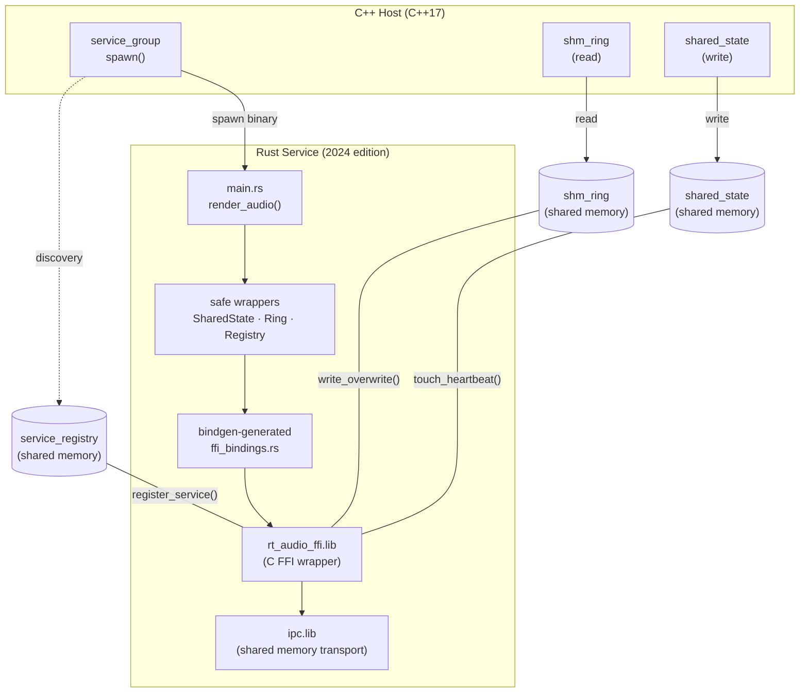
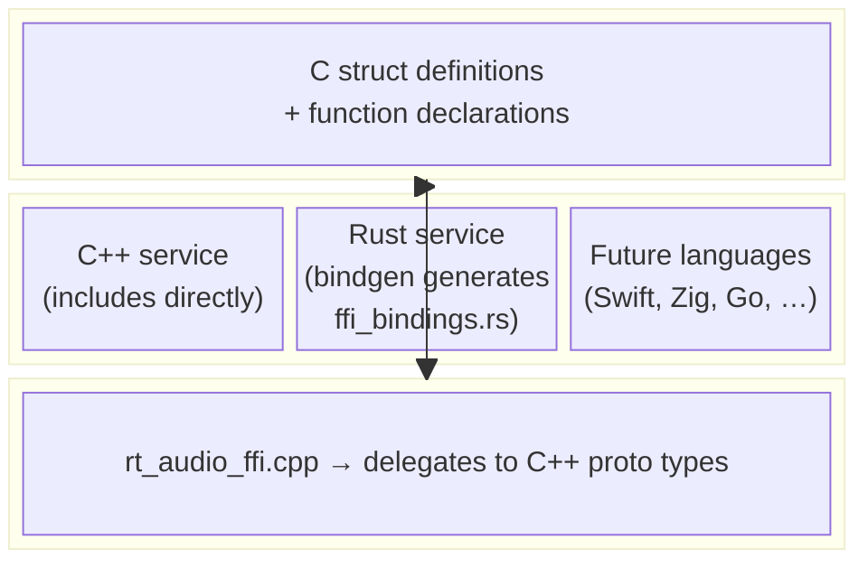

<!-- SPDX-License-Identifier: MIT -->
<!-- SPDX-FileCopyrightText: 2025-2026 natyamatsya contributors -->

# Cross-Language Services via C FFI

Process separation decouples not just the language standard (C++17 host with
C++23 services) but the *language itself*.  This document describes the approach
used to implement a Rust 2024 edition service that is a drop-in replacement for
the C++ service in the real-time audio demo.

## Motivation

The out-of-process architecture means each service binary communicates
exclusively through shared memory — byte-level protocols that are
language-agnostic.  The C++ proto layer (`shm_ring`, `service_registry`,
`shared_state`, `rt_prio`) encapsulates all the platform-specific shared memory
and synchronization details.  A thin C FFI wrapper exposes these operations as
plain C functions that any language with a C FFI can call.

This yields three concrete benefits:

1. **Team flexibility** — audio DSP engineers can write render code in Rust,
   Swift, or Zig while the orchestration host stays in C++.
2. **Safety guarantees** — Rust's ownership model applies to the service logic
   even though the underlying IPC is implemented in C++.
3. **Independent toolchains** — the Rust crate uses its own compiler, package
   manager, and edition; the C++ side uses CMake and MSVC/Clang/GCC.

## Architecture





## The C FFI Wrapper

`demo/audio_realtime/rt_audio_ffi.h` is the **single source of truth** for the
wire format.  It declares:

| Function group          | Wraps                                    | Purpose                              |
| ----------------------- | ---------------------------------------- | ------------------------------------ |
| `rt_ffi_shared_state_*` | `shared_state` (atomics in shm)          | Read config, gain, pan; heartbeat    |
| `rt_ffi_ring_*`         | `shm_ring<audio_block, 4>`               | Lock-free SPSC ring buffer           |
| `rt_ffi_registry_*`     | `service_registry`                       | Service discovery and registration   |
| `rt_ffi_set_realtime_priority` | `set_realtime_priority`             | MMCSS (Windows) / Mach (macOS)       |
| `rt_ffi_audio_period_ns`| `audio_period_ns`                        | Period computation helper            |
| `rt_ffi_getpid`         | `_getpid()` / `getpid()`                | Portable PID                         |

The implementation (`rt_audio_ffi.cpp`) delegates directly to the C++ proto
types — no reimplementation, no protocol duplication.

The `rt_ffi_audio_block` struct is defined in the C header with explicit padding
to match the C++ `audio_block` layout (including `alignas(16)` on `samples[]`).
Static assertions in the `.cpp` file verify size and offset compatibility at
compile time.

## Bindgen: Eliminating Manual Struct Matching

The Rust crate does **not** contain any hand-written `#[repr(C)]` struct
definitions or `extern "C"` blocks.  Instead, the `build.rs` script runs
[bindgen](https://rust-lang.github.io/rust-bindgen/) against `rt_audio_ffi.h`:

```rust
let bindings = bindgen::Builder::default()
    .header("../rt_audio_ffi.h")
    .derive_default(true)
    .derive_copy(true)
    .allowlist_function("rt_ffi_.*")
    .allowlist_type("rt_ffi_.*")
    .allowlist_var("RT_FFI_.*")
    .generate()
    .expect("bindgen failed");
```

This auto-generates `ffi_bindings.rs` at build time with the correct layout,
padding, alignment, and function signatures.  The generated file is included in
a private module:

```rust
mod ffi {
    include!(concat!(env!("OUT_DIR"), "/ffi_bindings.rs"));
}
use ffi::rt_ffi_audio_block as AudioBlock;
```

If the C header changes (new fields, reordered members, alignment changes), the
Rust bindings regenerate automatically on the next `cargo build`.  The
`alignas(16)` padding issue that would have been a silent data corruption bug is
now impossible.

## Safe Wrappers

The raw bindgen output uses `*mut c_void` handles and C strings.  The Rust
service wraps these in idiomatic safe types:

```rust
struct SharedState(Handle);
impl SharedState {
    fn open(name: &str) -> Option<Self> { ... }
    fn sample_rate(&self) -> u32 { ... }
    fn gain(&self) -> f32 { ... }
    fn touch_heartbeat(&self) { ... }
}
impl Drop for SharedState {
    fn drop(&mut self) { unsafe { ffi::rt_ffi_shared_state_close(self.0) } }
}
```

Each wrapper owns its handle, implements `Drop` for automatic cleanup, and
exposes a safe API.  All `unsafe` is confined to the wrapper boundary.

## CMake Integration

The build system detects Rust automatically:

```cmake
find_program(CARGO_EXECUTABLE cargo)
if(CARGO_EXECUTABLE)
    # ... build rt_audio_ffi static lib, then invoke cargo
endif()
```

CMake passes the library search paths as environment variables:

```cmake
${CMAKE_COMMAND} -E env
    "RT_AUDIO_FFI_LIB_DIR=$<TARGET_FILE_DIR:rt_audio_ffi>"
    "IPC_LIB_DIR=$<TARGET_FILE_DIR:ipc>"
    ${CARGO_EXECUTABLE} build --release
```

The Rust `build.rs` reads these and emits the appropriate `cargo:rustc-link-*`
directives.  If `cargo` is not on `PATH`, the Rust target is silently skipped —
no error, no broken build.

The resulting binary is copied next to the C++ executables:

```text
build/bin/Release/
├── rt_audio_host.exe           (C++17 host)
├── rt_audio_service.exe        (C++23 service)
└── rt_audio_service_rs.exe     (Rust 2024 service)
```

## Running

The C++ host accepts any service binary as its argument:

```bash
# C++23 service (default)
./build/bin/rt_audio_host ./build/bin/rt_audio_service

# Rust 2024 service (drop-in replacement)
./build/bin/rt_audio_host ./build/bin/rt_audio_service_rs
```

The host spawns, discovers, streams audio through, fails over, and shuts down
the Rust service identically to the C++ service.  It has no knowledge of the
service language.

## Linking Details

The Rust binary statically links:

| Library          | Contents                                              |
| ---------------- | ----------------------------------------------------- |
| `rt_audio_ffi`   | C FFI wrapper around proto types                      |
| `ipc`            | cpp-ipc shared memory transport                       |
| `advapi32` (Win) | Windows security APIs (used by shm)                   |
| `kernel32` (Win) | Windows process/memory APIs                           |
| C++ runtime      | MSVC CRT (auto), `libc++` (macOS), `libstdc++` (Linux)|

On macOS, the crate links `libc++`; on Linux, `libstdc++`.  On Windows with
MSVC, the C++ runtime is linked automatically.

## Adding Another Language

To add a service in a new language (Swift, Zig, Go, etc.):

1. **Include `rt_audio_ffi.h`** — it is the contract.
2. **Link `rt_audio_ffi` + `ipc`** — they provide the implementation.
3. **Implement `main()`** — parse `argv[1]` for the instance ID, open the
   shared state and ring buffer, register in the service registry, enter the
   render loop.
4. **Add a CMake target** — detect the language toolchain with `find_program`,
   build conditionally.

The C FFI header is designed to be consumable by any language that supports C
interop.  No C++ headers, templates, or name mangling are exposed.

## Design Decisions

**Why a C FFI wrapper instead of reimplementing the protocol in Rust?**

The proto types (`shm_ring`, `service_registry`) contain non-trivial
platform-specific logic (Windows named file mappings, POSIX shm_open, spinlock
protocols, reference counting).  Reimplementing this in Rust would be
error-prone and create a second source of truth.  The FFI wrapper ensures the
Rust service uses the *exact same* code paths as the C++ service.

**Why bindgen instead of hand-written FFI?**

The `audio_block` struct has `alignas(16)` on its `samples[]` field, which
inserts 8 bytes of implicit padding that is invisible in the source code.
Hand-writing the Rust struct required guessing this padding — and we got it
wrong on the first attempt.  Bindgen reads the actual layout from the C compiler
and generates the correct `#[repr(C)]` struct automatically.

**Why not use FlatBuffers for everything?**

The real-time audio demo deliberately avoids FlatBuffers on the data path to
achieve zero-allocation, zero-serialization audio streaming.  For the control
path (the `audio_service` demo), FlatBuffers is the right choice — it provides
schema evolution and language-neutral serialization.  The two demos illustrate
different points on the performance/flexibility spectrum.
